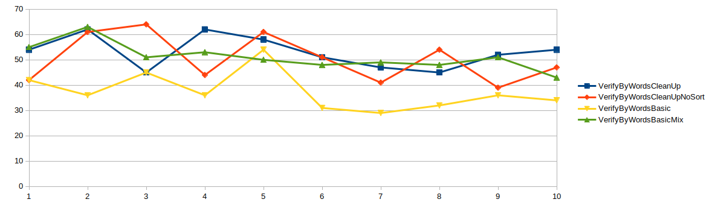
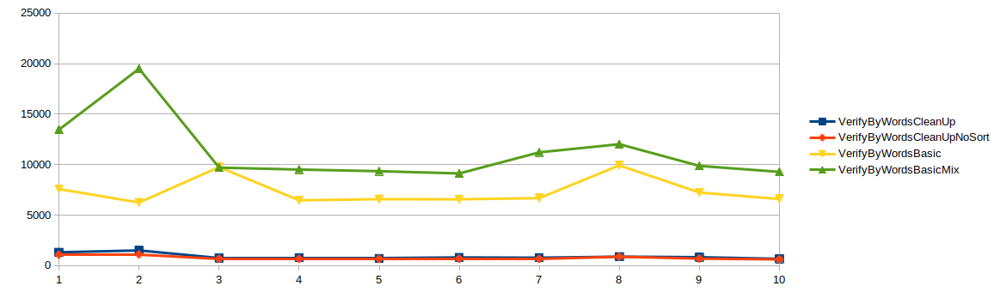

## Introduction
This exercise consiste in verifying that a message is in a larger text like a magazine. In order to accomplish this, 4 different algorithms have
been created. The main class is in the App.java file, in there, the Verify class is created using an Strategy Pattern to inject the algorithm
that we would like to use at run time.
 

## Puzzle challenge description
You are a spy in a conflict zone who must maintain daily communication with your partners. 
To verify the authenticity of the messages received, you know messages are generated from letters found on a popular magazine published daily. 
To speed up the process of validating the message ownership you write a function that takes two strings as arguments: first, containing all the
letters in the message you want to validate; and second, all the letters 
found in today's magazine.
The function should return true (your partner contacted you) or false 
(the enemy is at the gates) accordingly. 
Try to make your function efficient.  You must assume that the magazine can
be arbitrarily long while the message is normally very short.
Please use Big-O notation to explain how long it takes your function to run 
in terms of the length of your message (n) and the number of letters in the 
magazine (m).You may spend as much time as you like, but a couple of hours
should be sufficient.

## Big O Notation
m = length of the message
n = lenght of the magazine

The complexity for the VerifyByWordsBasic is: O(m)*O(n)

 

## Algorithms

* **VerifyByWordsBasic**: 
    * Normalizing text, removing punctuation marks and making it lowercase.

* **VerifyByWordsBasicMix**
    * Normalizing text, removing punctuation marks and making it lowercase.
    * Removing duplicates for the magazine text and sorting the result list.

* **VerifyByWordsCleanUp**
    * Normalizing text, removing punctuation marks and making it lowercase.
    * Removing duplicates for the magazine text and sorting the result list.
    * Removing duplicates for the msg text and sorting the result list.

* **VerifyByWordsCleanUpNoSort**
    * Normalizing text, removing punctuation marks and making it lowercase.
    * Removing duplicates for the magazine text.
    * Removing duplicates for the msg text.

 
 

## Build/Run Me
By default if no arguments passed it will get the files from the src/main/resources directory
* Build jar: mvn package
* Run jar: from the root directory **java -cp ./target/puzzle-1.0-SNAPSHOT.jar com.jorda.puzzle.App**

If you want to pass your own msg/magazine those need to be in the same directory than the .jar
* Run jar with args: from the root directory **java -cp ./target/puzzle-1.0-SNAPSHOT.jar com.jorda.puzzle.App /msg.txt /magazine.txt**

 
 

## BenchMark

### Test standard use case scenario where msg is relatively short and magazine relatively long

##### For this test the msg comes from the msg.txt file and the magazine from the DON_QUIJOTE_DE_LA_MANCHA.txt

| Iteration  | VerifyByWordsCleanUp | VerifyByWordsCleanUpNoSort | VerifyByWordsBasic | VerifyByWordsBasicMix
|------:|------:|------:|------:|------:|
| 0 | 54ms | 42ms | 42ms | 55ms |
| 1 | 62ms | 61ms | 36ms | 63ms |
| 2 | 45ms | 44ms | 45ms | 51ms |
| 3 | 62ms | 61ms | 36ms | 53ms |
| 4 | 58ms | 51ms | 54ms | 50ms |
| 5 | 51ms | 41ms | 31ms | 48ms |
| 6 | 47ms | 54ms | 29ms | 49ms |
| 7 | 45ms | 39ms | 32ms | 48ms |
| 8 | 52ms | 47ms | 36ms | 51ms |
| 9 | 54ms | 44ms | 34ms | 43ms |

  

 

### Test where msg and magazine are very long strings

For this test both msg and magazing have taken from the file (DON_QUIJOTE_DE_LA_MANCHA.txt) The idea behing this test was to analise what would happen in scenarios where the input msg is very
long, in this case exactly as long as the magazine(DON_QUIJOTE_DE_LA_MANCHA.txt)

| Iteration   | VerifyByWordsCleanUp | VerifyByWordsCleanUpNoSort | VerifyByWordsBasic | VerifyByWordsBasicMix
|------:|------:|------:|------:|------:|
| 0 | 1317ms | 1075ms | 7577ms | 13468ms |
| 1 | 1504ms | 1111ms | 6246ms | 19490ms |
| 2 | 751ms | 682ms | 9754ms | 9699ms |
| 3 | 779ms | 668ms | 6461ms | 9510ms |
| 4 | 705ms | 665ms | 6576ms | 9345ms |
| 5 | 807ms | 679ms | 6562ms | 9124ms |
| 6 | 780ms | 655ms | 6684ms | 11211ms |
| 7 | 884ms | 873ms | 9922ms | 12025ms |
| 8 | 831ms | 690ms | 7233ms | 9867ms |
| 9 | 669ms | 611ms | 6595ms | 9278ms |

 

 
 

## Conclusions
For the normal use case where the message will be rather small and the magazine could be randomly large
all algorithm have similar performance, hightlighting the **VerifyByWordsBasic** that may perform slightly faster, since it does not have
the overhead off removing the duplicates neither it sorts the arrays.
But for large messages (in the tests as large as the magazine), it changes quite a bit, and the algorithms that include improvements such as
removing duplicated words and sorting the arrays (**VerifyByWordsCleanUp**, **VerifyByWordsCleanUpNoSort** ) perform much better than the others two.
